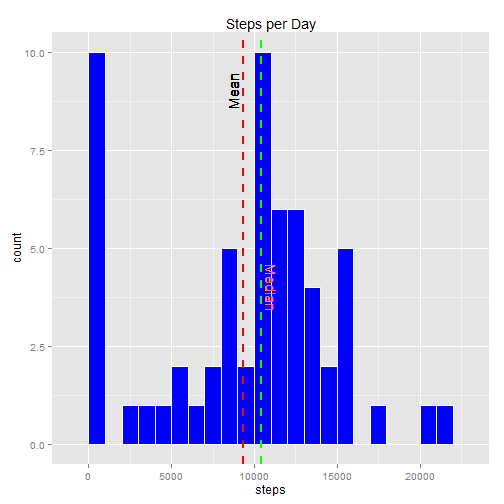
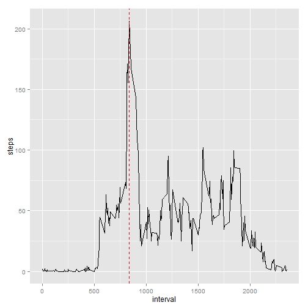
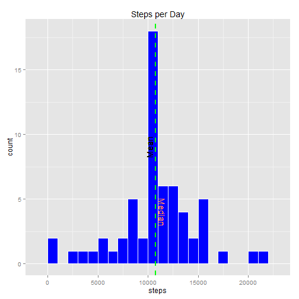
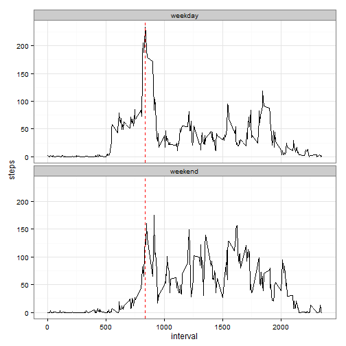

#Introduction
This assignment makes use of data from a personal activity monitoring device. This device collects data at 5 minute intervals through out the day. The data consists of two months of data from an anonymous individual collected during the months of October and November, 2012 and include the number of steps taken in 5 minute intervals each day.

#Loading and preprocessing the data
Before beginning, be sure to set the working directory to the location where the activity data and this Markdown file are located using `setwd()` The data has been provided in the form of a zip file.  First we must unzip the file and read it into R using `read.csv()`


```r
unzip(zipfile = "repdata-data-activity.zip")

data <- read.csv("activity.csv")
```

#What is the mean total number of steps taken per day?
In order to answer this question, we we will first add up all the steps in each day using the `aggregate()` function and store the resulting data frame as `total.steps`.  `NA` values will be removed from the data for this portion of the analysis.  Additionally, we will rename the variables their original names for convenience.


```r
total.steps <- aggregate(data$steps,list(data$date),sum,na.rm = TRUE)

names(total.steps) <- c("date","steps")
```

Next, we will create a histogram from the `total.steps` data using the `ggplot2` package.


```r
require(ggplot2)

ggplot(total.steps, aes(x=steps)) + geom_histogram(binwidth=1000,colour = "white",fill = "blue") + 
    geom_vline(aes(xintercept=mean(steps)),color="red",linetype="dashed",size=1) + 
    geom_vline(aes(xintercept=median(steps)),color="green",linetype="dashed",size=1,) + 
    labs(title = "Steps per Day") +
    geom_text(aes(mean(steps),9,label = "Mean",angle = 90,vjust = -.5)) +
    geom_text(aes(median(steps),4,label = "Median",angle = 270,vjust = -.5,colour = "red"))+
    theme(legend.position="none")
```

 

As you can see on the graph above, the mean and median of the dataset has been marked.  Here are their respective values:

```r
mean(total.steps$steps)
```

```
## [1] 9354.23
```

```r
median(total.steps$steps)
```

```
## [1] 10395
```

#What is the average daily activity pattern?
Now we will examine the average number of steps taken in each 5-minute interval each day again using the `aggregate()` function and create a time series plot using the resulting data frame.  `NA` values will be removed once more.


```r
interval.steps <- aggregate(data$steps, list(interval = data$interval), mean, na.rm = TRUE)

names(interval.steps) <- c("interval","steps")

ggplot(interval.steps,aes(interval,steps)) + geom_line() + 
    geom_vline(aes(xintercept = interval[steps == max(steps)]),colour = "red", linetype = "dashed")
```

 

I have added a dashed line to the graph indicating the interval with the maximum number of steps.  Here is its value:


```r
interval.steps$interval[interval.steps$steps == max(interval.steps$steps)]
```

```
## [1] 835
```

#Imputing missing values
First, lets us find the total number of `NA` values:


```r
sum(is.na(data$steps))
```

```
## [1] 2304
```

Next, we will calculate the average number of steps in each interval across each day and replace each `NA` value with the corresponding average number of steps for that interval.


```r
steps.ave <- aggregate(data$steps,list(interval = data$interval),mean,na.rm = TRUE)

data1 <- data

data1$steps.ave <- c(rep(steps.ave$x,times = length(unique(data1$date))))

data1$steps[is.na(data1$steps)] <- data1$steps.ave[is.na(data1$steps)]
```

Now, let's make a new histogram looking at the data without `NA` values.


```r
total.steps <- aggregate(data1$steps,list(data1$date),sum)

names(total.steps) <- c("date","steps")

ggplot(total.steps, aes(x=steps)) + geom_histogram(binwidth=1000,colour = "white",fill = "blue") + 
    geom_vline(aes(xintercept=mean(steps)),color="red",linetype="dashed",size=1) + 
    geom_vline(aes(xintercept=median(steps)),color="green",linetype="dashed",size=1,) + 
    labs(title = "Steps per Day") +
    geom_text(aes(mean(steps),9,label = "Mean",angle = 90,vjust = -.5)) +
    geom_text(aes(median(steps),4,label = "Median",angle = 270,vjust = -.5,colour = "red"))+
    theme(legend.position="none")
```

 

Here is the new mean and median of the data:


```r
mean(total.steps$steps)
```

```
## [1] 10766.19
```

```r
median(total.steps$steps)
```

```
## [1] 10766.19
```

Notice that these values are different than those from the first part of the assignment.  Since the `NA` values were replaced with mean of all the other values, they were no longer treated as 0's by the histogram and consequently increased the mean and median values.

#Are there differences in activity patterns between weekdays and weekends?
Now, let's examine how activity patterns differ based on whether it was a weekday or a weekend. First, to find out which dates are which days, we must use the `weekdays()` function: 


```r
data$days <- weekdays(as.Date(data$date))
```

Next, let's create a new variable to indicate whether the day is a weekday or a weekend day:


```r
data$days[which(data$days != "Saturday" & data$days != "Sunday")] <- "weekday"

data$days[which(data$days == "Saturday" | data$days == "Sunday")] <- "weekend"
```

We will use the `aggregate()` function once again to average the steps across all days, but this time we will also differentiate between weekday steps and weekend steps.


```r
interval.steps <- aggregate(data$steps, list(data$interval,data$days), mean, na.rm = TRUE)

names(interval.steps) <- c("interval","days","steps")
```

Finally, let's create a time series plot comparing the weekend and weekday steps:


```r
ggplot(interval.steps,aes(interval,steps)) + geom_line() + 
    geom_vline(aes(xintercept = interval[steps == max(steps)]),colour = "red",linetype = "dashed") + 
    facet_wrap(~days,nrow=2) + theme_bw()
```

 

As the graph above indicates, weekdays have a much higher number of step quanties in earlier intervals which then taper off considerably.  By contrast, while weekend days still have a higher number of step quanties in earlier intervals, activity stays higher throughout much of the rest of the day.
